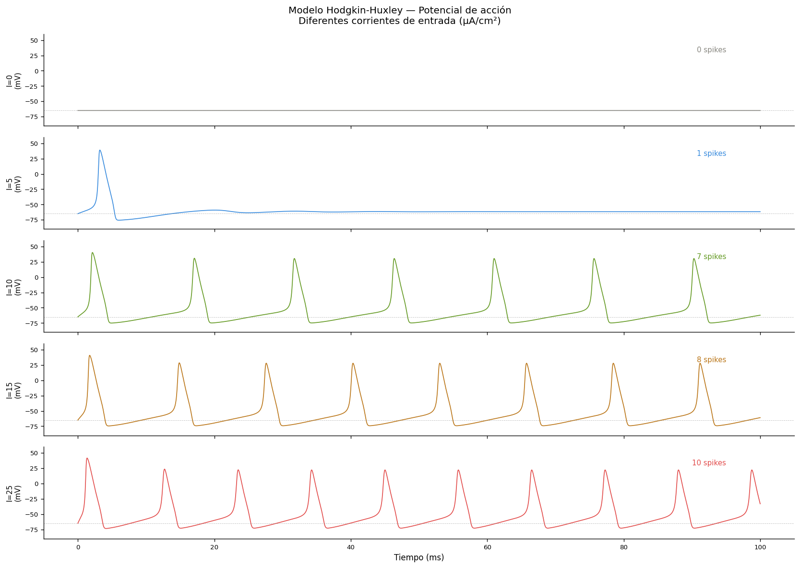
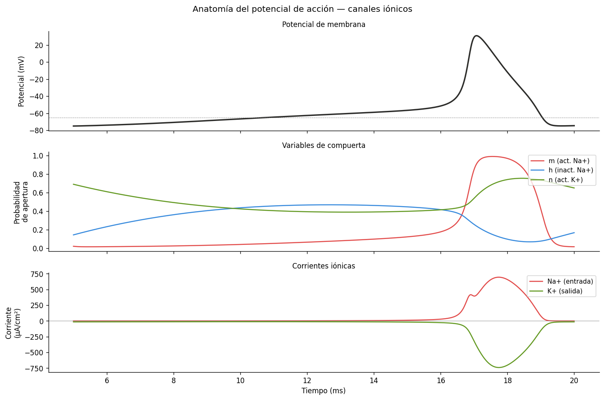
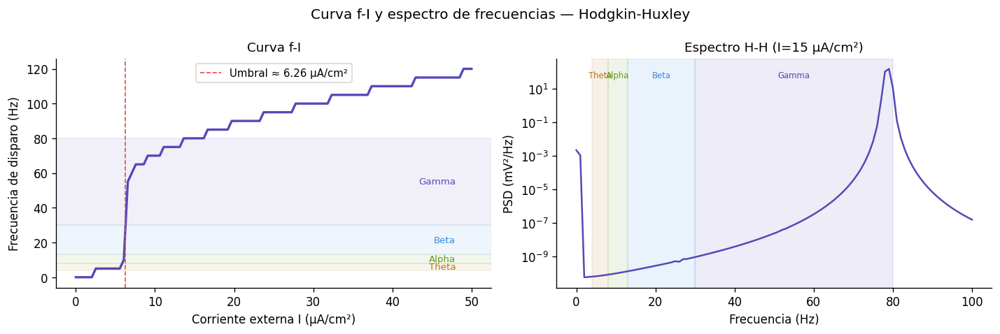
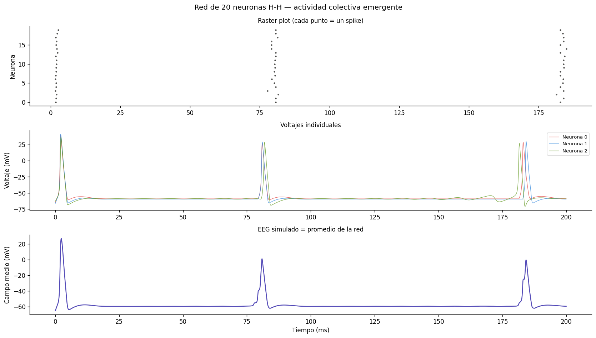
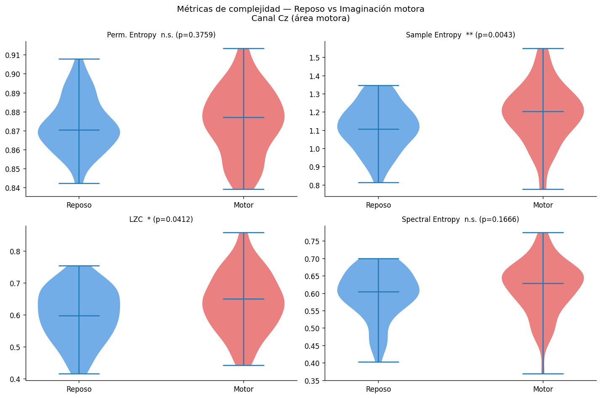
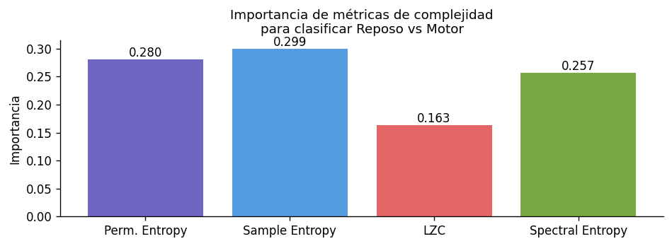

# comp-neuro-projects

**Computational Neuroscience — from biophysics to information theory**  
*Applied to real EEG signals and epilepsy detection*

---

## Overview

Two interconnected projects exploring the bridge between **neural biophysics** and **information theory**, applied to real brain signals.

```
Hodgkin-Huxley (single neuron)
        ↓
Network of 20 H-H neurons → simulated EEG
        ↓
Complexity metrics (LZC, entropy)
        ↓
Real EEG — motor imagery (EEGBCI) + epilepsy (CHB-MIT)
        ↓
Finding: LZC drops during epileptic seizures
```

---

## Notebooks

### 1. `comp_neuro_v1.ipynb` — Hodgkin-Huxley + Information Theory

**Part 1 — Hodgkin-Huxley model (1952)**

Full biophysical simulation of the action potential from scratch using the original 4-ODE system:

$$C_m \frac{dV}{dt} = I_{ext} - g_{Na} m^3 h (V - E_{Na}) - g_K n^4 (V - E_K) - g_L (V - E_L)$$

- Action potential at different input currents (f-I curve)
- Na⁺/K⁺ ionic channel dynamics visualised
- Network of 20 coupled H-H neurons with synapses
- Simulated EEG as emergent mean field

**Key finding:** The f-I curve directly maps to EEG frequency bands — theta, alpha, beta, and gamma oscillations emerge from neuronal firing rates, not from arbitrary convention.

**Part 2 — Information-theoretic complexity metrics**

| Metric | What it measures |
|--------|-----------------|
| Permutation Entropy | Distribution of ordinal patterns |
| Sample Entropy | Self-similarity across scales |
| Lempel-Ziv Complexity (LZC) | Number of unique substrings |
| Spectral Entropy | Power distribution across frequencies |

Applied to:
- Simulated H-H signal (theoretical baseline)
- Real EEG — resting vs motor imagery (EEGBCI, subject 1, channel Cz)
- Real EEG — interictal vs preictal vs ictal (CHB-MIT chb01)

**Statistical results (resting vs motor, Mann-Whitney):**

| Metric | p-value | Significance |
|--------|---------|-------------|
| Permutation Entropy | 0.3759 | n.s. |
| Sample Entropy | 0.0043 | ** |
| LZC | 0.0412 | * |
| Spectral Entropy | 0.1666 | n.s. |

Sample Entropy and LZC significantly distinguish resting from motor imagery — the motor state generates more complex, less predictable signals.

---

### 2. `eeg_epilepsy_v1.ipynb` — Seizure Detection (CHB-MIT)

**Dataset:** CHB-MIT Scalp EEG (PhysioNet) — patient chb01, 5 files with annotated seizures

**Pipeline:**
```
Raw EEG (256 Hz, 23 channels)
    ↓  Bandpass 0.5–50 Hz + Notch 50 Hz
    ↓  Segment: 10s windows, 50% overlap
    ↓  Features: spectral bands + line length + statistical moments
    ↓  Random Forest / SVM / Gradient Boosting
Interictal / Preictal / Ictal classification
```

**Labels:**
- `Interictal` — ≥1 hour from any seizure
- `Preictal` — 5 minutes before seizure onset
- `Ictal` — during seizure

**Feature engineering:**
- Relative band power: delta, theta, alpha, beta, gamma
- Signal variance and mean absolute amplitude
- **Line length** — sum of absolute differences between consecutive samples, sensitive to epileptiform spikes

The line length feature is particularly motivated: neurologists visually detect epileptic spikes as sharp, high-amplitude transients. Line length quantifies this morphological property numerically.

---

## Central Finding

**Lempel-Ziv Complexity drops during epileptic seizures.**

The brain loses informational complexity when neurons synchronise pathologically. A healthy brain continuously explores its state space — LZC is high. During a seizure, activity collapses into a low-dimensional repetitive cycle — LZC drops.

This connects to Wheeler's *It from Bit* (1990): the seizure represents a collapse of informational complexity, a reduction in the bits generated per unit time by the neural system.

**Implication for detection:** LZC can serve as a lightweight, interpretable feature for seizure detection in wearable devices — no spectral decomposition required, computable in real time.

---

## Datasets

| Dataset | Source | Size | Description |
|---------|--------|------|-------------|
| EEGBCI | PhysioNet (MNE) | ~5 MB/subject | Motor imagery, 109 subjects, 64 channels, 160 Hz |
| CHB-MIT | PhysioNet | ~100 MB/file | Paediatric epilepsy, 23 subjects, annotated seizures |

Both datasets download automatically on first run.

---

## Requirements

```bash
pip install mne scikit-learn matplotlib numpy scipy antropy
```

| Library | Version | Purpose |
|---------|---------|---------|
| mne | ≥1.0 | EEG loading, preprocessing, EEGBCI dataset |
| antropy | ≥0.1.6 | LZC, permutation entropy, sample entropy |
| scikit-learn | ≥1.0 | Classification, cross-validation |
| scipy | ≥1.7 | ODE integration (H-H), Welch PSD |

---

## Results

### Hodgkin-Huxley action potential


### Ionic channel dynamics


### f-I curve and frequency spectrum


### Network activity (20 neurons)


### Complexity metrics — resting vs motor imagery


### Feature importance


---

## Theoretical background

The connection between H-H biophysics and information-theoretic complexity is not arbitrary:

- **High LZC** → the system generates new information at each instant → high informational complexity → *coherence*
- **Low LZC** → the system repeats patterns → collapse to a low-dimensional attractor → *incoherence*

An epileptic seizure is, in Wheeler's terms, a **loss of informational complexity** — the brain stops exploring its state space and collapses into a cycle. The same metric that quantifies this collapse in biology quantifies exploration vs exploitation in any dynamical system.

---

## Related projects

- [`arc-qrl-peps-solver`](https://github.com/QuantumDrizzy/arc-qrl-peps-solver) — Quantum RL agent for ARC-AGI-3
- [`eeg-epilepsy`](https://github.com/QuantumDrizzy) — Motor imagery BCI: RF → CSP+SVM → EEGNet → VQC

---

*Built with MNE · antropy · scikit-learn · scipy*  
*Datasets: PhysioNet EEGBCI + CHB-MIT Scalp EEG*
